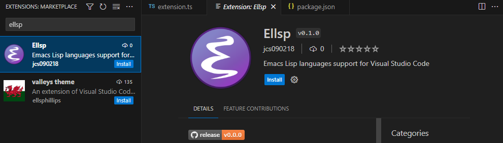

# vscode-ellsp
> Emacs Lisp languages support for Visual Studio Code

## 💾 Installation

Install the [Ellsp][] extension directly from the [VSCode Marketplace][].

Then follow the instructions [here](https://github.com/jcs090218/ellsp#-installation)
to install the language server! 🎉

## 📇 Commands

| Commands      | Description                        |
|:--------------|:-----------------------------------|
| `ellsp.start` | Start the `shader langauge server` |
| `ellsp.stop`  | Stop the `shader langauge server`  |

## ⚜️ License

This program is free software; you can redistribute it and/or modify
it under the terms of the GNU General Public License as published by
the Free Software Foundation, either version 3 of the License, or
(at your option) any later version.

This program is distributed in the hope that it will be useful,
but WITHOUT ANY WARRANTY; without even the implied warranty of
MERCHANTABILITY or FITNESS FOR A PARTICULAR PURPOSE.  See the
GNU General Public License for more details.

You should have received a copy of the GNU General Public License
along with this program.  If not, see <https://www.gnu.org/licenses/>.

See [`LICENSE`](./LICENSE) for details.

<!-- Links -->

[Ellsp]: https://marketplace.visualstudio.com/items?itemName=jcs090218.Ellsp
[VSCode Marketplace]: https://marketplace.visualstudio.com/vscode
